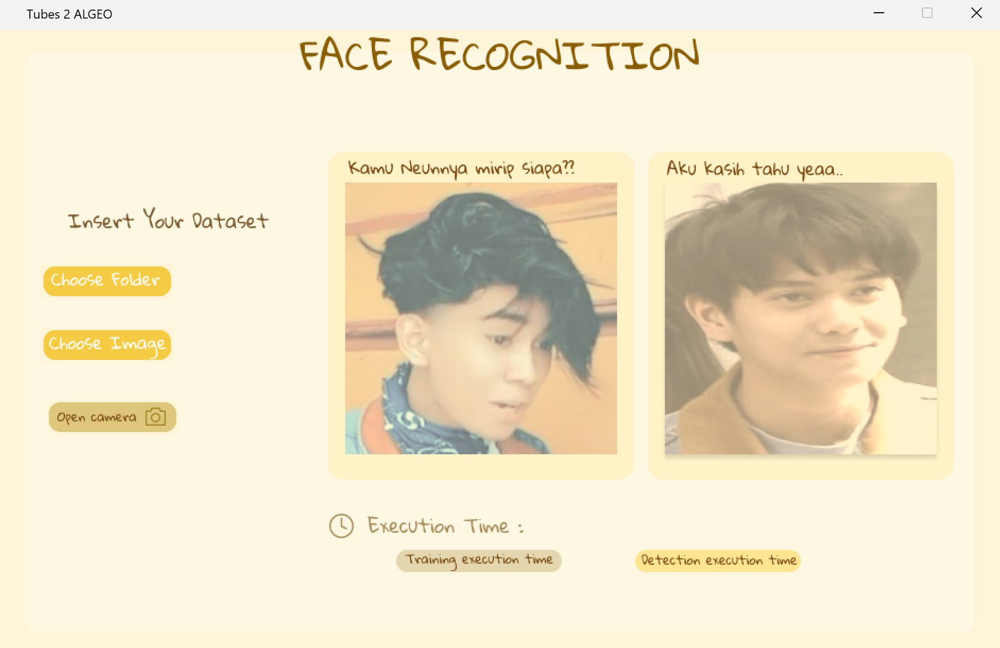
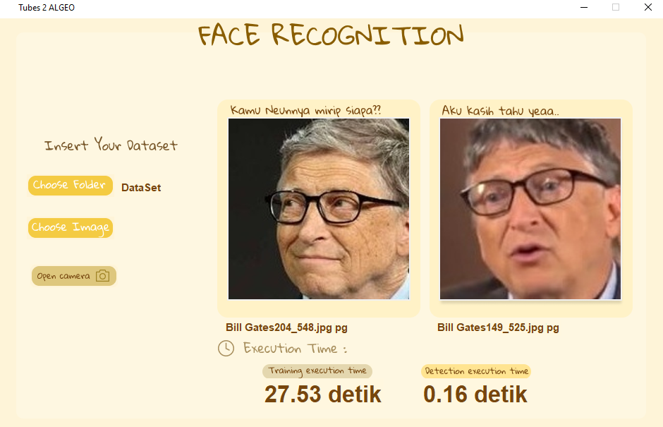
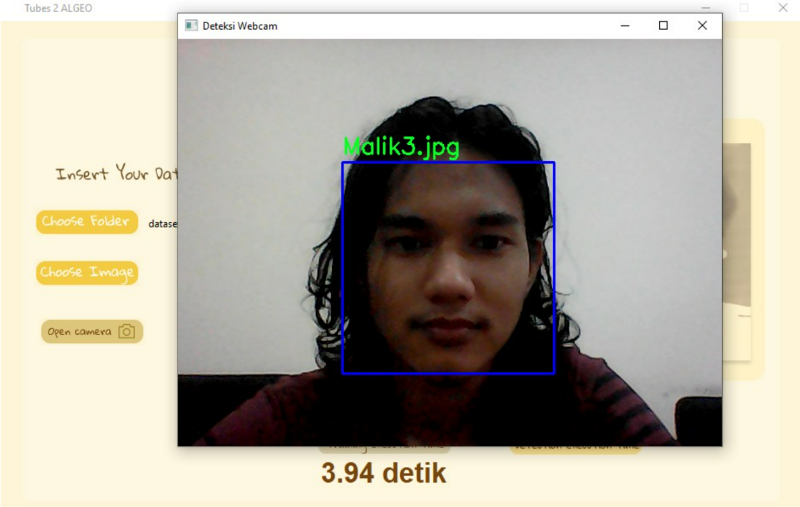

# Tugas Besar 2 IF 2123 Aljabar Linier dan Geometri
> Aplikasi Nilai Eigen dan EigenFace pada Pengenalan Wajah (Face Recognition)

## Table of Contents
* [Deskripsi Umum](#deskripsi-umum)
* [Teknologi](#teknologi)
* [Fitur](#fitur)
* [Tampilan](#tampilan)
* [Struktur](#struktur)
* [Cara menjalankan program](#cara-menjalankan-program)


## Deskripsi Umum
Terdapat berbagai teknik untuk memeriksa citra wajah dari kumpulan citra yang sudah diketahui seperti jarak Euclidean dan cosine similarity,  principal component analysis (PCA), serta Eigenface. Pada Tugas ini, akan dibuat sebuah program pengenalan wajah menggunakan Eigenface. Sekumpulan citra wajah akan digunakan dengan representasi matriks. Dari representasi matriks tersebut akan dihitung sebuah matriks Eigenface. Program pengenalan wajah dapat dibagi menjadi 2 tahap berbeda yaitu tahap training dan pencocokkan. Pada tahap training, akan diberikan kumpulan data set berupa citra wajah. Citra wajah tersebut akan dinormalisasi dari RGB ke Grayscale (matriks), hasil normalisasi akan digunakan dalam perhitungan eigenface menggunakan eigenvector.


## Teknologi
- numpy     -   versi 1.23.4
- opencv    -   versi 4.6.0.66
- tkinter   -   versi 0.1.0
- Pillow    -   versi 9.3.0
- time
- os


## Fitur
- Face Recognition berdasarkan file gambar
- Face Recognition berdasarkan webcam


## Tampilan
### Tampilan Awal


### Tampilan Setelah Pencocokan Wajah



### Tampilan Pencocokan Wajah dengan Webcam


## Struktur
```bash
.
│   README.md
│
├───doc                             # Laporan
│   ├───Algeo02-21026.pdf
├───src                             # Source code
│   ├───Algoritma                   # Algoritma
│   │       faceAlignment.py
│   │       function.py
│   │       getEigenFace.py
│   │       getFolder.py
│   │       gui.py
│   │       main.py
│   │
│   ├───Assets                        # Assets
│   │       cam.png
│   │       detect.png
│   │       dilanbg1.png
│   │       folder1.png
│   │       folder2.png
│   │       icon.ico
│   │       img1.png
│   │       img2.png
│   │       notfound.png
│   │       presentase.png
│   │       result1.png
│   │       result2.png
│   │       train.png
│   │       typex.png
│   │
│   ├───Dataset                        # Dataset   
│   │       Copa.jpg
│   │       Copa1.jpg
│   │       Copa2.jpg
│   │       Copa3.jpg
│   │       Copa4.jpg
│   │       Malik.jpg
│   │       Malik1.jpg
│   │       Malik2.jpg
│   │       Malik3.jpg
│   │       Malik4.jpg
│   │
│   ├───Tampilan                      # Tampilan
│   │       Tampilan.png
│   │       Tampilan1.png
│   │       
└───test                              # Testing cases
            Copa1.jpg
            Copa2.jpg
            Copa3.jpg
            Copa4.jpg
            Copa5.jpg
            Jauza1.jpg
            Jauza2.jpg
            Jauza3.jpg
            Jauza4.jpg
            Jauza5.jpg
            Malik.jpg
            Malik1.jpg
            Malik2.jpg
            Malik3.jpg
            Malik4.jpg

```

## Cara menjalankan program
1. Install seluruh library yang diperlukan (numpy, tkinter, opencv, pillow)
2. Clone repositori ini
3. Buka cmd pada windows atau terminal pada Linux
4. Ubah directory ke lokasi repositori yang sudah di-clone
5. Ketik 'python src/Algoritma/main.py' pada cmd atau windows yang directorinya telah diubah
6. Program sudah dapat dijalankan dengan menekan tombol "choose folder" untuk memilih folder dataset
7. Notifikasi akan muncul setelah dataset berhasil di-train
8. Pengguna dapat memilih deteksi wajah berdasarkan file gambar dengan menekan tombol "choose image"
    atau webcam secara realtime dengan menekan tombol "open camera"
9. Program akan menampilkan nama gambar yang mirip

